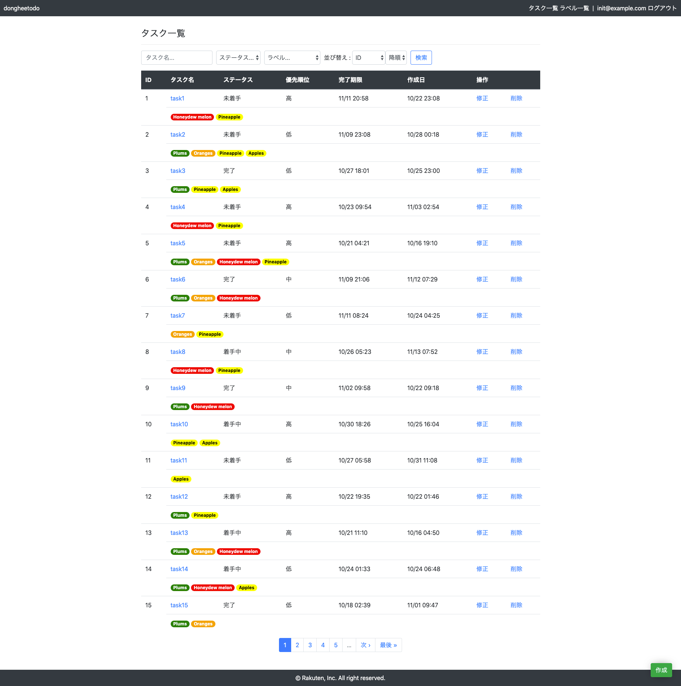

# README

## Dongheetodo

A To-Do Application for studying Ruby On Rails



### Requirement

- bundle 1.17.3
- ruby 2.5.5
- yarn 1.17.3
- mysql 5.6.43

### Install

```
$ bundle install
$ yarn install
$ cp config/local_env.yml.example config/local_env.yml
$ bundle exec rails db:create
$ bundle exec rails db:migrate
$ bundle exec rails db:seed
```

### Usage

#### with docker-compose

```
$ docker-compose build .
$ docker-compose up -d
$ docker-compose run web db:create
$ docker-compose run web db:migrate RAILS_ENV=development
```

Open with browser:

```
http://localhost:3000
```

Initial account is as below:

- ID: init@example.com
- PW: hogehoge


### Test

```
$ bundle exec rspec
```

### Maintenance mode

You can change the mode of application by executing the maintenance task.

```
# Start maintenance mode 
$ bundle exec rails maintenance:up

# Stop maintenance mode 
$ bundle exec rails maintenance:down
```
