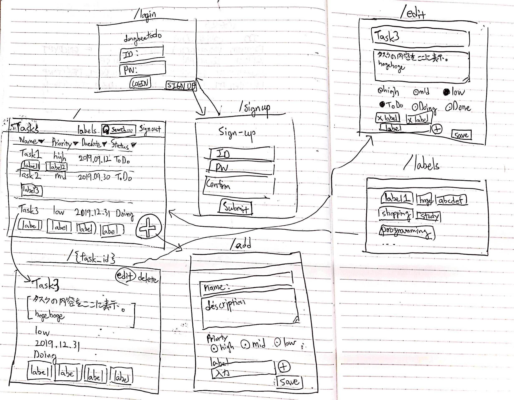

# アプリケーション設計

## 要件定義
- 自分のタスクを簡単に登録したい
- タスクに終了期限を設定できるようにしたい
- タスクに優先順位をつけたい
- ステータス（未着手・着手・完了）を管理したい
- ステータスでタスクを絞り込みたい
- タスク名・タスクの説明文でタスクを検索したい
- タスクを一覧したい。一覧画面で（優先順位、終了期限などを元にして）ソートしたい
- タスクにラベルなどをつけて分類したい
- ユーザ登録し、自分が登録したタスクだけを見られるようにしたい
- メンテナンスを実施できるようにしたい
-  （追加機能）ユーザの管理機能

## ルーティング

 - /signin：ログインページ
 - /signup：会員登録ページ
 - /： タスク一覧
 - /task/detail/{task_id}： タスク詳細ページ
 - /task/add/{task_id}： タスク登録ページ
 - /task/edit/{task_id}： タスク詳細修正ページ
 - /labels： ラベル一覧

## 画面設計

## データベース

### テーブル一覧

- USERS: ユーザデータ
- TASKS: タスクデータ
- LABELS: タスクのラベルデータ

### テーブル関係

- USERS　＜ーーー１：多ーーー　TASKS
- TASKS　＜ーーー１：多ーーー　LABELS

### 詳細

- USERS

column_name | data_type | primary | is_nullable | default | foreign_key | extra | comment
------------|-----------|:---------:|-------------|---------|--------|------|----|
ID        | VARCHAR(18) | ◯ | NOT NULL |   |  | |ユーザID
PASSWORD       | VARCHAR(255) | | NOT NULL |   |  |  | 暗号化されたパスワード
EMAIL        | VARCHAR(255) | | NOT NULL |   |  | | ex) donghee_kim@fablic.co.jp
CREATED_AT        | DATETIME |  | NOT NULL |   |  | | 作成時刻
UPDATED_AT        | DATETIME |  | NOT NULL |   |  | | 修正時刻

- TASKS

column_name | data_type | primary | is_nullable | default | foreign_key | extra | comment
------------|-----------|:---------:|-------------|---------|--------|------|----|
ID        | INT | ◯ | NOT NULL |   |  | AUTO_INCREMENT | タスクID
USER_ID | VARCHAR(18) | | NOT NULL | | USERS.ID | | | ユーザID
NAME        | VARCHAR(255) |  | NOT NULL |   |  | | タスク名 ex) iPhone11を買う
DESCRIPTION        | TEXT |  |  |   |  | | タスク内容
PRIORITY        | TINYINT |  | NOT NULL |   |  | |　優先順位（1: 低 2: 中 3: 高）
STATUS        | TINYINT |  | NOT NULL |   |  | | ステータス（1: 未着手 2: 着手 3: 完了）
DUEDATE        | DATETIME |  |  |   |  | | 終了期限 ex) 2019.09.12
CREATED_AT        | DATETIME |  | NOT NULL |   |  | | 作成時刻
UPDATED_AT        | DATETIME |  | NOT NULL |   |  | | 修正時刻

- TASK_LABELS

column_name | data_type | primary | is_nullable | default | foreign_key | extra | comment
------------|-----------|:---------:|-------------|---------|--------|------|----|
ID        | INT | ◯ | NOT NULL |   |  | AUTO_INCREMENT | ラベルID
TASK_ID | INT | | NOT NULL | | TASKS.ID | | | タスクID
NAME        | VARCHAR(255) |  | NOT NULL |   |  | | ラベル名 ex) 買い物
CREATED_AT        | DATETIME |  | NOT NULL |   |  | | 作成時刻
