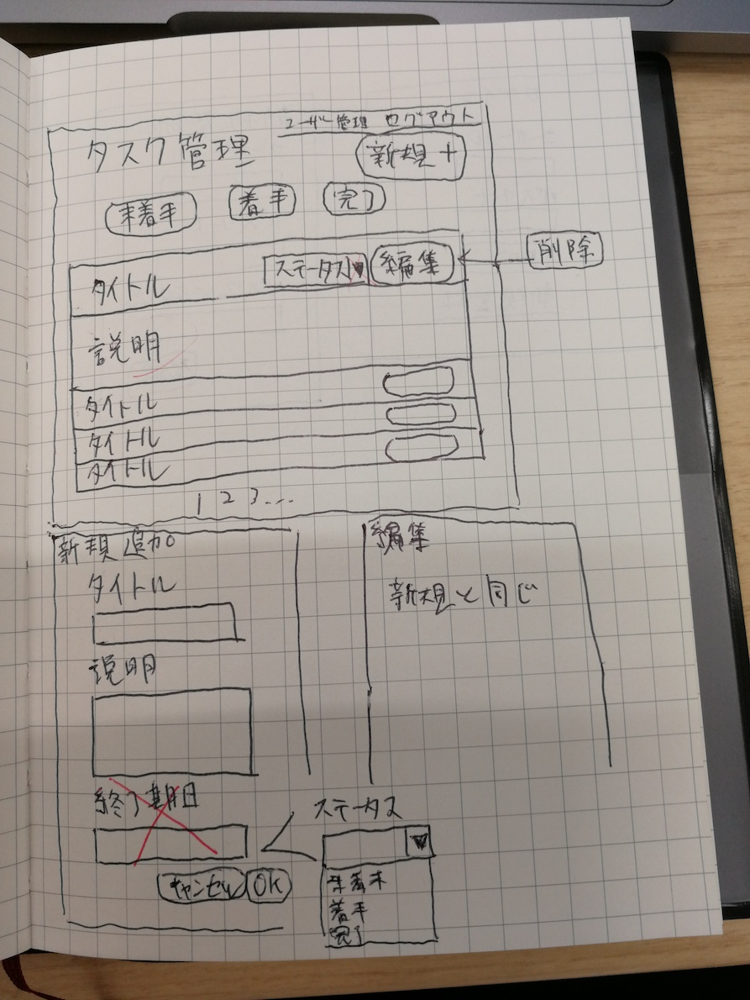
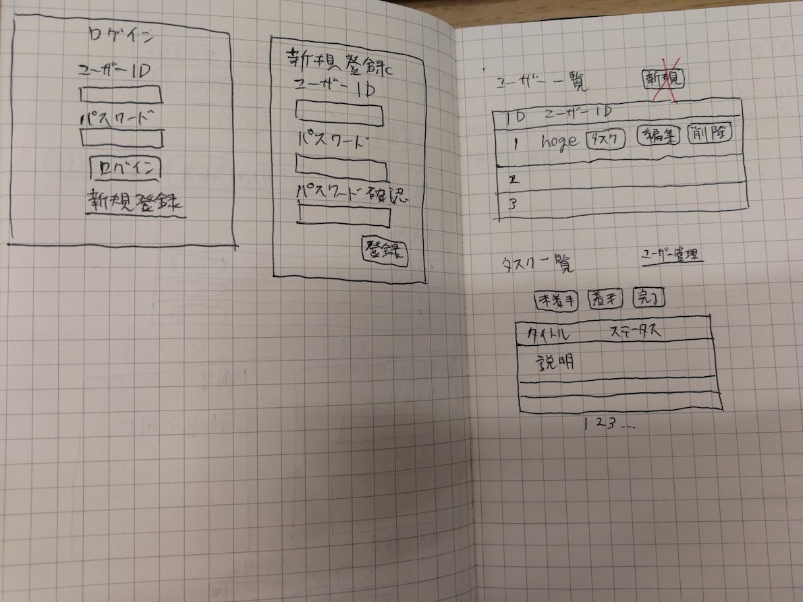

## アプリ画面イメージ
### タスク一覧/タスク新規登録/タスク編集

### ユーザーログイン/ユーザー登録/ユーザー管理


## DB設計
```
-- タスクテーブル
create table tasks(
    id int unsigned auto_increment,
    user_id int unsigned not null,
    status tinyint unsigned not null default 0,
    title varchar(255) not null,
    description text,
    created_at timestamp not null default current_timestamp,
    updated_at timestamp not null default current_timestamp on update current_timestamp,

    primary key(id),
    index idx_user_created(user_id, status, created_at),
    index idx_user_updated(user_id, status, updated_at)
);

-- ユーザーテーブル
create table users(
    id int unsigned auto_increment,
    login_id varchar(255) not null unique,
    password varchar(255) not null,
    created_at timestamp not null default current_timestamp,
    updated_at timestamp not null default current_timestamp on update current_timestamp,

    primary key(id),
    index idx_user(login_id)
);
```