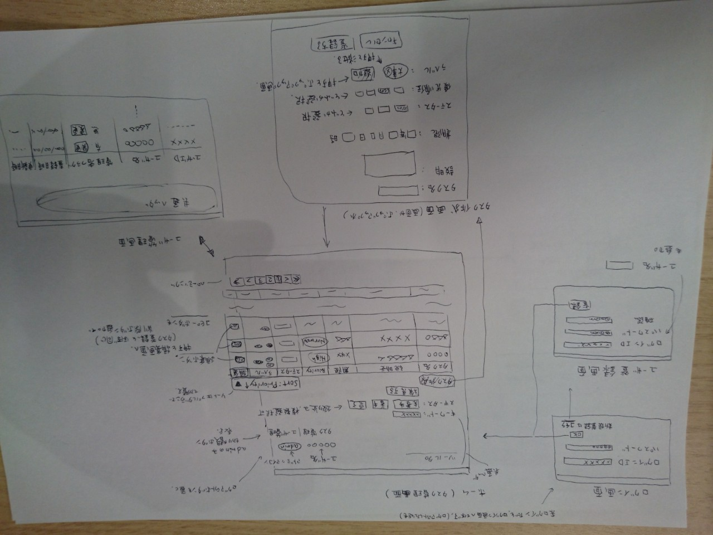
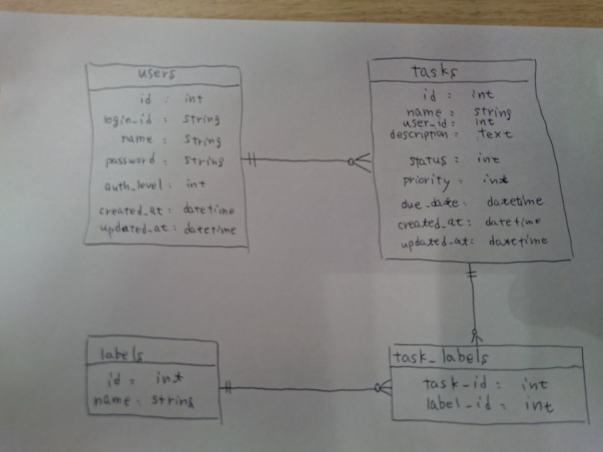

# Document for this Application

## 概要

### Requirement

- 自分のタスクを簡単に登録したい
- タスクに終了期限を設定できるようにしたい
- タスクに優先順位をつけたい
- ステータス（未着手・着手・完了）を管理したい
- ステータスでタスクを絞り込みたい
- タスク名・タスクの説明文でタスクを検索したい
- タスクを一覧したい。一覧画面で（優先順位、終了期限などを元にして）ソートしたい
- タスクにラベルなどをつけて分類したい
- ユーザ登録し、自分が登録したタスクだけを見られるようにしたい

また、上記の要件を満たすにあたって、次のような管理機能がほしいと考えています。

- ユーザの管理機能

### サポートブラウザ

- サポートブラウザはmacOS/Chrome各最新版を想定しています

### Versions 

- Ruby 2.5.3
- Rails 5.2.2
- MySQL 5.6.42

### Screen Draft

### Data Model Draft

