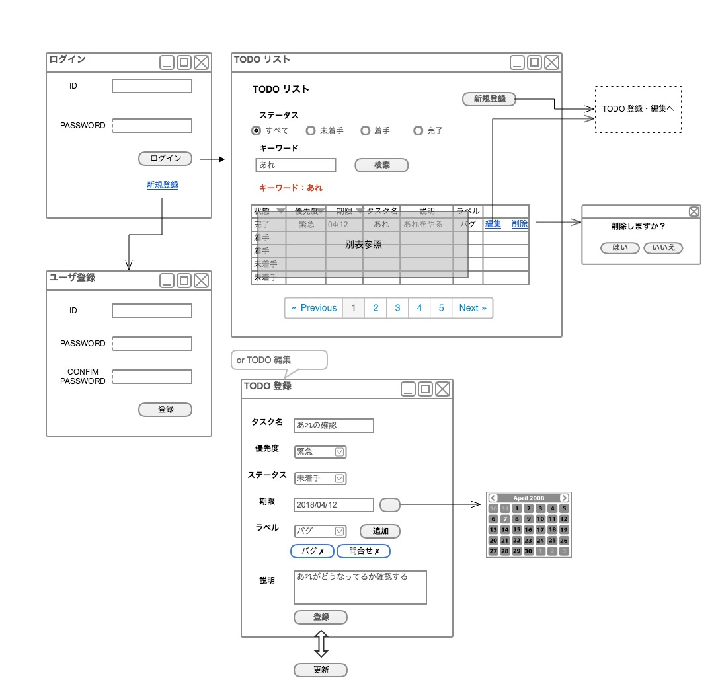
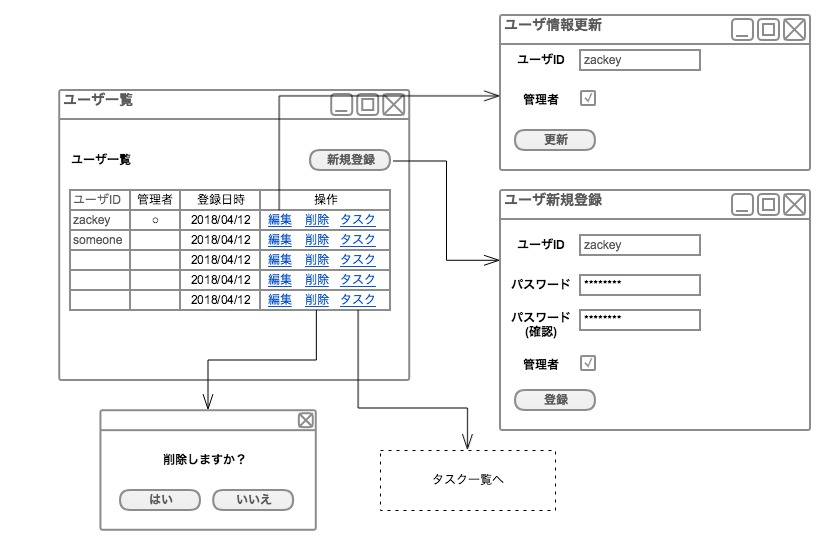
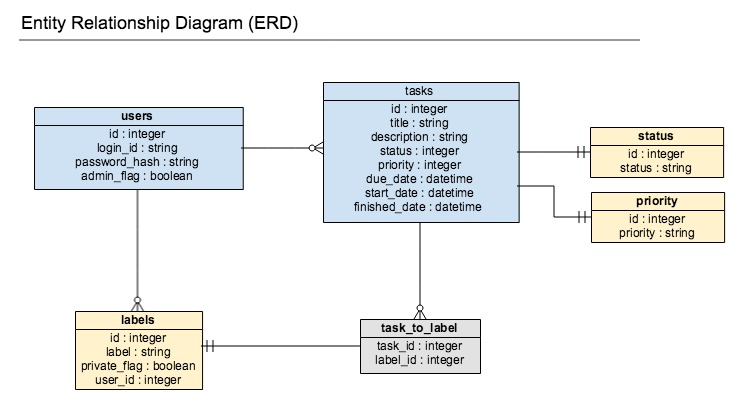

# システム要件
### 要求事項
- 自分のタスクを簡単に登録できる
- タスクに終了期限を設定できる
- タスクに優先順位をつけられる
- ステータス（未着手・着手・完了）を管理できる
- ステータスでタスクを絞り込める
- タスク名・タスクの説明文でタスクを検索できる
- タスクを一覧したい。一覧画面で（優先順位、終了期限などを元にして）ソートできる
- タスクにラベルなどをつけて分類できる
- ユーザ登録し、自分が登録したタスクだけを見られる

上記の要件を満たすにあたって、次のような管理機能を実装する

- ユーザの管理機能

### サポートブラウザ

- サポートブラウザはmacOS/Chromeの2018/04/12時点の各最新版を想定

### アプリケーション（サーバ）の構成について

以下の言語・ミドルウェアを使って構築する
（いずれも2018/04/12時点の最新の安定バージョン）。

- Ruby 2.5.1
- Ruby on Rails 5.2.0
- MySQL 5.6

#ユーザ画面

###TODO リスト
|状態　▼|優先度　▼|期限　▼|タスク名|説明|ラベル|登録日時|着手日時|完了日時|
|---|---|---|---|---|---|---|---|---|
|完了|緊急|2018/04/12|あれの確認|あれを確認する|確認|
|着手|なるはや|2018/04/12|これ|これをやっておく|バグ|2018/04/02|2018/04/03|-|
|着手|ASAP|2018/04/12|それ|それもやっておく|その他|2018/04/03|2018/04/04|-|
|未着手|至急|2018/04/12|なにか|なにかなんとかする|-|2018/04/04|-|-|
|未着手|いますぐ|2018/04/12|ほげ|Hoge|-|2018/04/05|-|-|

#管理画面
※最初の管理者はDBに直接登録

#データベース

