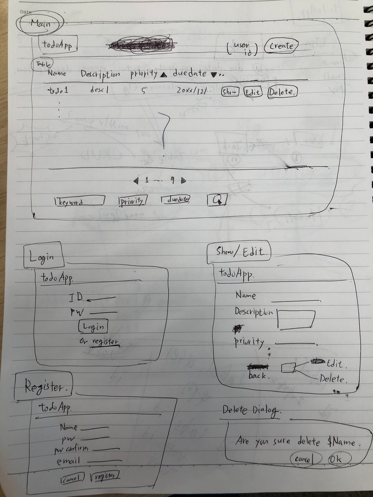
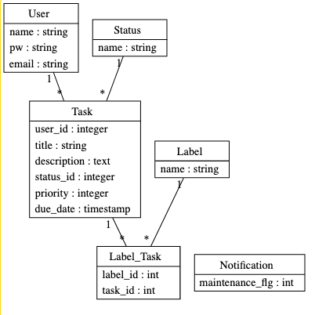

# README
Simple Todo Application by rails.

## Rough Prototype

## ERD
- id, created_at, updated_at are omiited.

## Maintenance
To start maintenance input the rake command below
> bundle exec rake maintenance:start

To end maintenance input the rake command below
> bundle exec rake maintenance:end

And you can always check the rake command list by
> bundle exec rake -T
