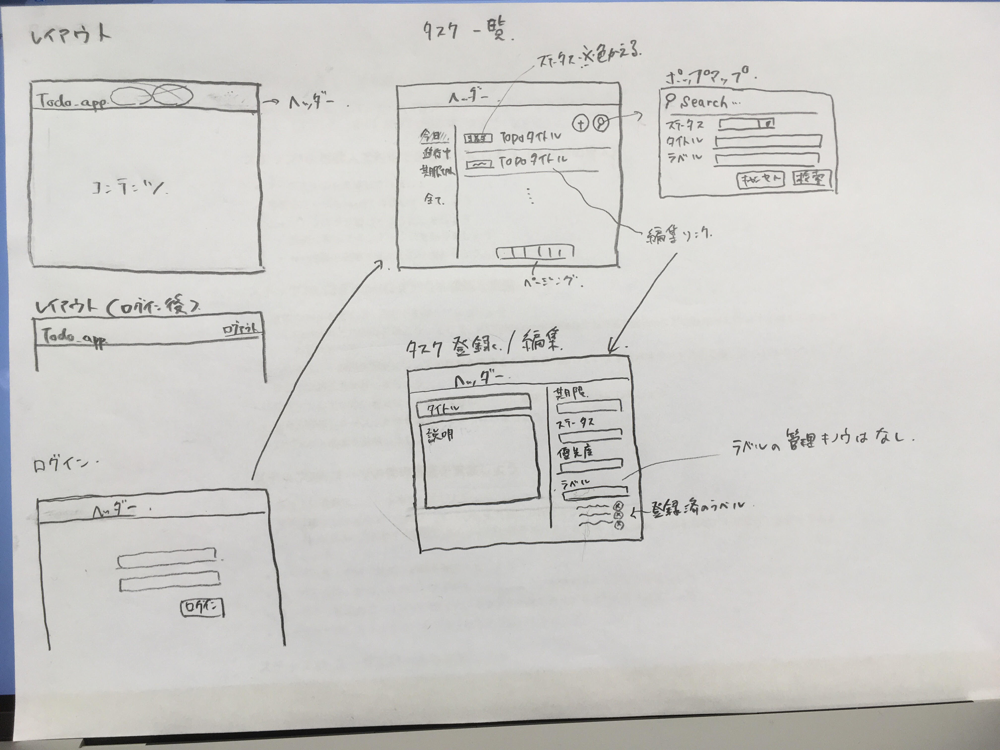
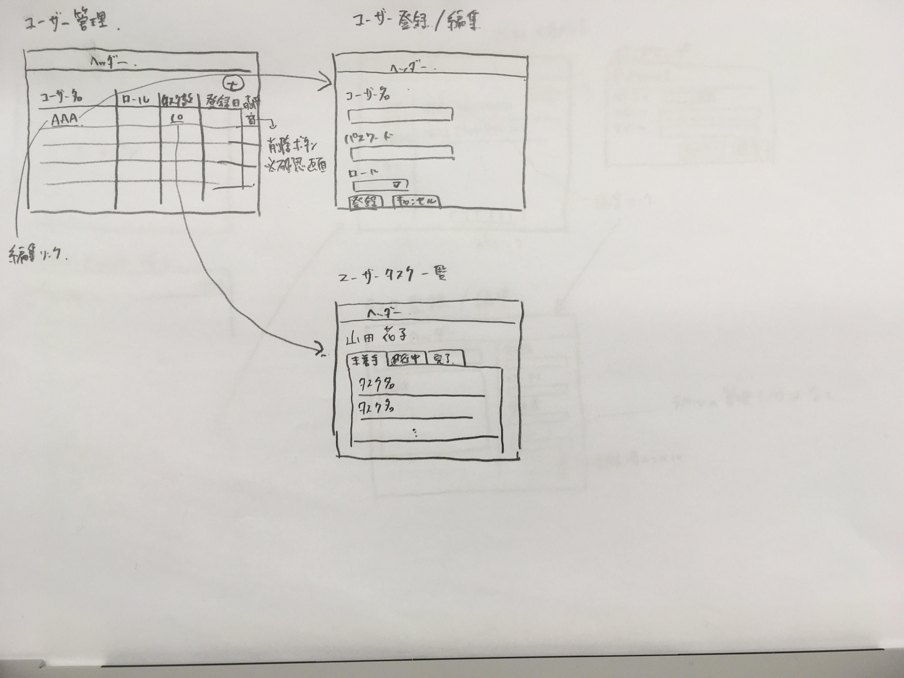
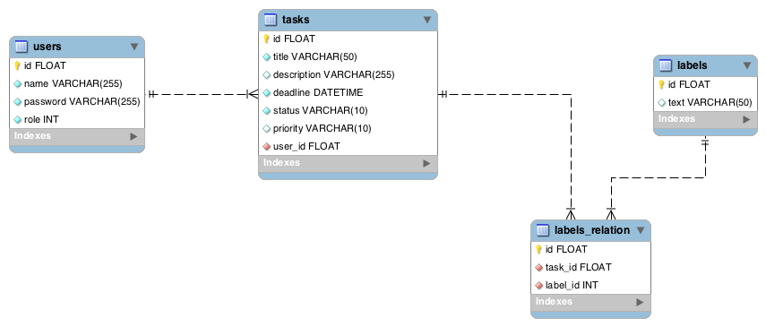

## About

todo-siteはユーザーのタスク管理システムを提供する。主な機能は以下の通り。

- タスク登録
    - タスク名、説明、優先度、開始日、期日、ステータスを登録し閲覧する機能を提供する
- ラベル
    - タスクにラベルをつけて分類分けする機能を提供する
- 一覧表示
    - 登録したタスクを期日ごとに一覧表示する機能を提供する
    - タスクの登録内容、ラベルで検索して表示する機能を提供する
- ユーザー管理機能
    - システムを利用するためにユーザー登録する機能を提供する
    - ユーザー情報を編集する機能を提供する
    - タスクはユーザーごとに登録・表示する機能を提供する

## サポートブラウザ

Google Chrome最新版をサポートする

## 画面イメージ

### 一般ユーザーが利用する画面

以下の画面を提供する

- ログイン画面
- タスク一覧画面
- タスク登録/編集画面

簡単な画面設計は以下の通り

### 管理ユーザーが利用する画面

- ユーザー管理
- ユーザー登録/編集
- ユーザータスク一覧

簡単な画面設計は以下の通り

## データ構造

ERは以下の通り

**補足事項**

- ロールは管理ユーザー/一般ユーザーの2つなため、0 or 1の2値とする
- labelsテーブルは、タスク登録画面でラベルを登録した際に永続化する
- タスク登録画面でラベルを削除した場合、labels_relationを消してlabelsテーブルは残したままとする
    - 次回使いたいときに再利用するため

    