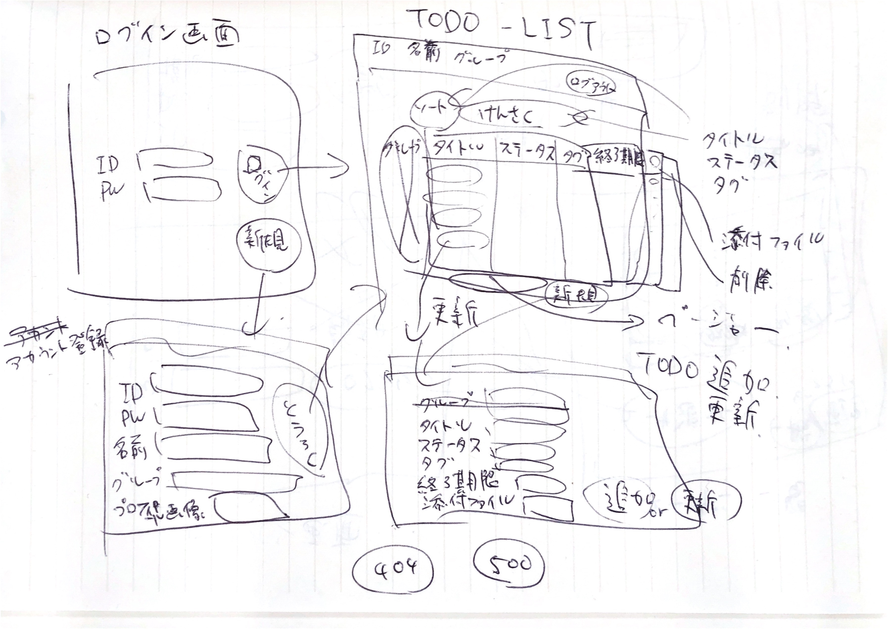
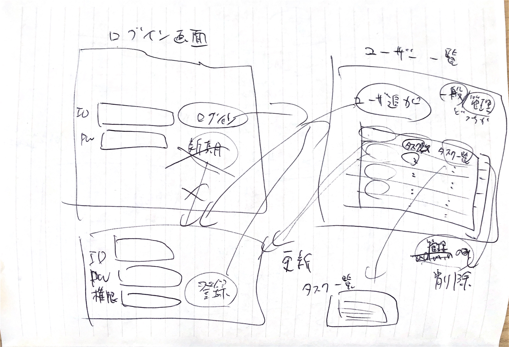

## 画面設計

### タスク表示

### 管理画面

### テーブル設計

#### users：ユーザ一覧
| カラム名 | 型 | プライマリキー | NULL | DEFAULT | 説明 |
|:-----------|:------------:|:------------:|:------------:|:------------|:------------|
| id | int | ○ | | | ユーザID, UNSINGED |
| email | varchar | | | | メールアドレス, UNIQ |
| encrypted_password | varchar | | | | 暗号化済みのパスワード |
| name | varchar | | | | ユーザ名 |
| group_id | int | | ○ | | ユーザのグループ INDEX, FOREIGN KEY groups.id |
| role | tinyint | | | | 1: 一般, 2:  管理者 |
| created_at | datetime | | | | 作成日付 |
| updated_at | datetime | | | | 更新日付 |

#### groups：ユーザの所属するグループ
| カラム名 | 型 | プライマリキー | NULL | DEFAULT | 説明 |
|:-----------|:------------:|:------------:|:------------:|:------------|:------------|
| id | int | ○ | | | グループID, UNSINGED |
| name | varchar | | | | グループ名 |
| created_at | datetime | | | | 作成日付 |
| updated_at | datetime | | | | 更新日付 |

#### tasks：ユーザの作成したタスクたち
| カラム名 | 型 | プライマリキー | NULL | DEFAULT | 説明 |
|:-----------|:------------:|:------------:|:------------:|:------------|:------------|
| id | int | ○ | | | タスクID, UNSINGED |
| user_id | int | | | | 作成したユーザID, INDEX, FOREIGN KEY users.id |
| title | varchar | | | | タスクのタイトル, INDEX |
| description | text | | ○ | | タスクの説明 |
| status | tinyint | | | | 1: 未着手、2: 着手中、3: 完了 INDEX |
| end_at | datetime | | ○ | | タスクの終了日付 |
| created_at | datetime | | | | 作成日付 |
| updated_at | datetime | | | | 更新日付 |

#### labels：タスクのラベル
| カラム名 | 型 | プライマリキー | NULL | DEFAULT | 説明 |
|:-----------|:------------:|:------------:|:------------:|:------------|:------------|
| id | int | ○ | | | ラベルID, UNSINGED |
| user_id | int | | | | 作成したユーザID, INDEX, FOREIGN KEY users.id |
| name | varchar | | | | ラベル名 |
| created_at | datetime | | | | 作成日付 |
| updated_at | datetime | | | | 更新日付 |

#### task_labels：ユーザの作成したタスクとラベルの紐づけ
| カラム名 | 型 | プライマリキー | NULL | DEFAULT | 説明 |
|:-----------|:------------:|:------------:|:------------:|:------------|:------------|
| id | int | ○ | | | ID, UNSINGED |
| users_id | int | ○ | | | 作成したユーザID, INDEX, FOREIGN KEY users.id |
| label_id | int | ○ | | | FOREIGN KEY labels.id |
| task_id | int | ○ | | | FOREIGN KEY tasks.id |

